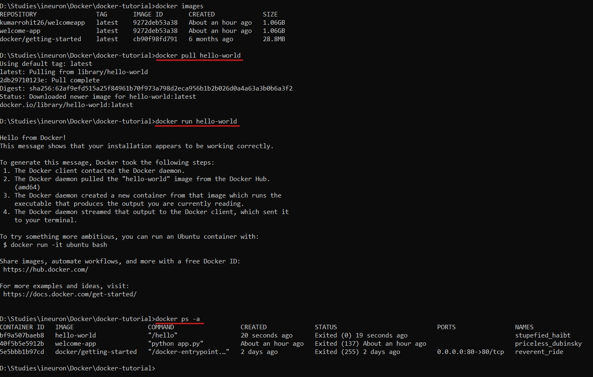

This project is created to have a better understanding of docker.

As part of this project, we have achieved below things.

1. Demonstarted basic docker commands with explanation and screenshots. ([Task 1](./Task_1/)).

2. Run [Hello World](https://hub.docker.com/_/hello-world) docker image locally. Below is the commands and screenshot.

```
> docker pull hello-world
> docker run hello-world
```


3. Created Hello World FastAPI application and pushed it to docker hub repository. Please find the image on this [link](https://hub.docker.com/repository/docker/kumarrohit26/fastapi-hello-world).

```To run the application in local```

- Without docker (Go to project directory and run the below command)
```
uvicorn main:app --reload
```
- With docker
```
docker pull kumarrohit26/fastapi-hello-world
```
```
docker run -d -p 80:80 kumarrohit26/fastapi-hello-world
```
PLease check the deployment at [http://127.0.0.1:80](http://127.0.0.1:80) and SwaggerUI at [http://127.0.0.1/docs](http://127.0.0.1/docs)