# 15 Basic docker commands

## 1. Docker Version : Get the currently installed version of docker.
```
docker -version
```

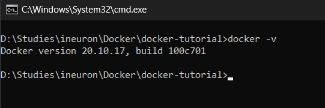

## 2. Docker Login : Login to the docker hub repository.

```
docker login
```
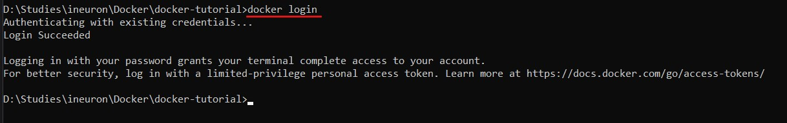

## 3. Docker Pull : Pull images from [docker hub repository](https://hub.docker.com/).

```
docker pull <image-name>
```
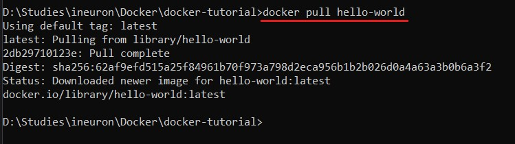

## 4. Docker images : Lists all locally stored docker images.

```
docker images
```
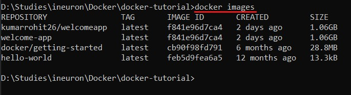

## 5. Docker run : create container from the image.

```
docker run -d -p 80:80 docker/getting-started
```
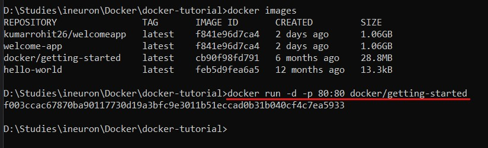

## 6. Docker ps : List all running container.

```
docker ps
```
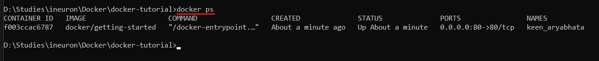

## 7. Docker ps -a : List all containers, running and exited.

```
docker ps -a
```
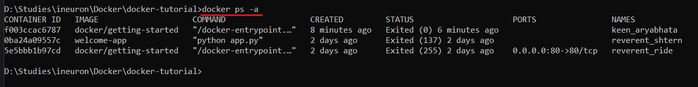

## 8. Docker rmi : Delete image.

```
docker rmi <image-name>
```
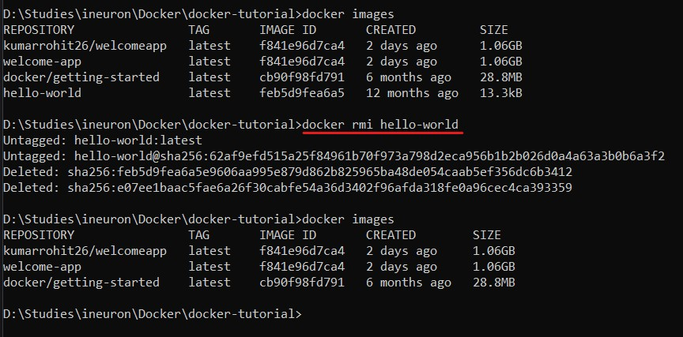

## 9. Docker stop : Stops running container.

```
docker stop <container-id>
```
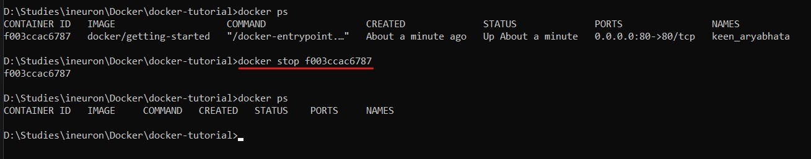

## 10. Docker kill : Kills running container by stopping its execution immediately. 'docker stop' gives time to shutdown normally and 'docker kill' shutdown immediately.

```
docker kill <container-id>
```
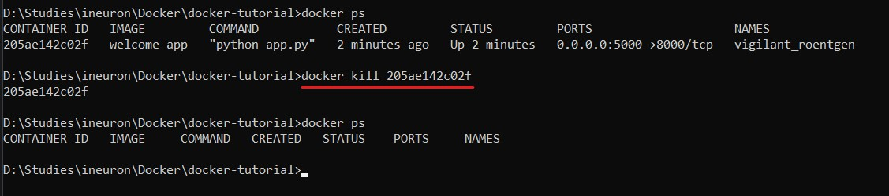

## 11. Docker rm : Removes container from local.

```
docker rm <container-id>
```
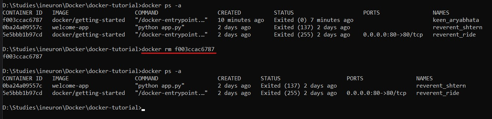

## 12. Docker logs : Get logs of container.

```
docker logs <container-id>
```
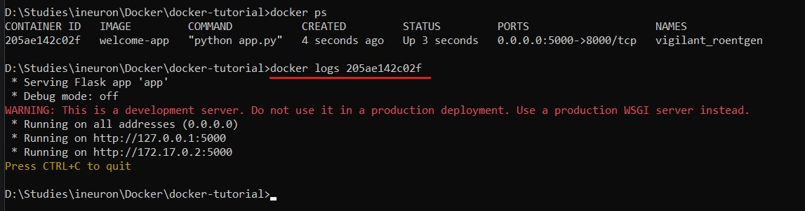

## 13. Docker build : Build docker image from specified docker file.

```
docker build -t <image-name> .
```
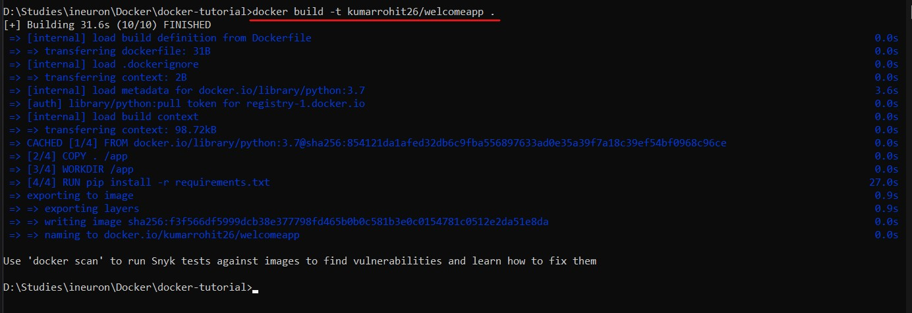

## 14. Docker push : Push docker image from local to [docker hub repository](https://hub.docker.com/).

```
docker push <username/image-name>:<tag-name>
```
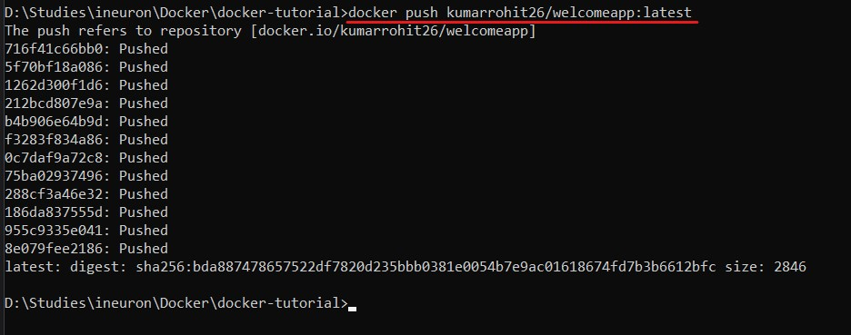

## 15. Docker exec : Access running container.

```
docker exec -it <container-name> bash
```
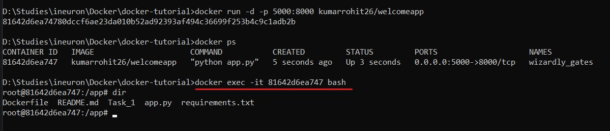
